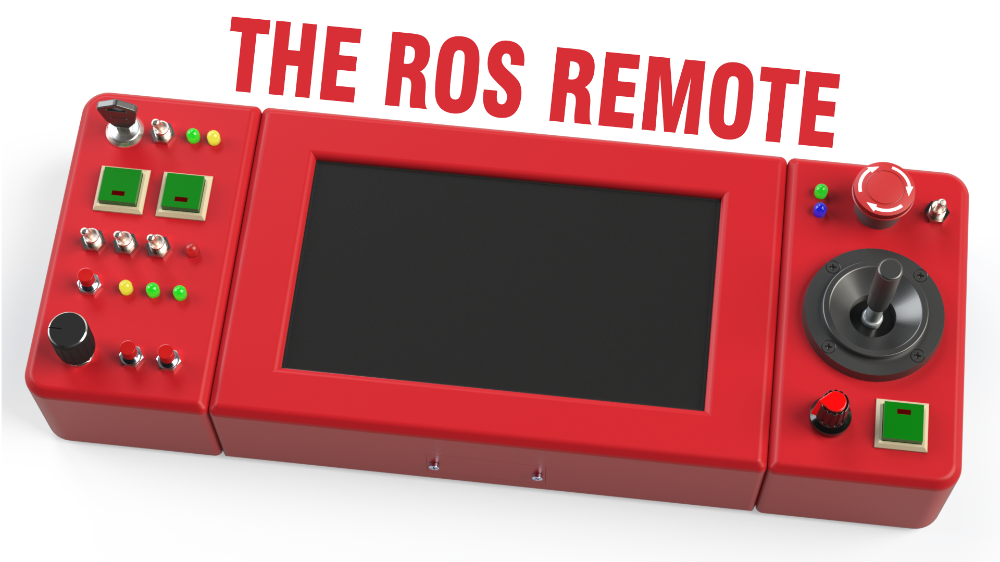

<h1 align="center">The ROS Remote Project</h1>

	 
	 
	  
	
	|
	
	  

----
> [!NOTE]
> This project is still under development!

  

This is a 3D render of the CAD designs.
  

## Overview

### TODO

 

## File Structure
There are 5 folders in this repository. 
Their names and purposes are as follows:

**.github** 
GitHub issue templates, pull request templates, etc. 

**Assets** 
Assets used on GitHub (such as images used in this README file). 

**CAD Files** 
3D CAD design files and 3D printing files. 

**Circuit Diagrams** 
Overall circuit diagrams. 

**Source Code** 
Source code for the remote touch UI and Raspberry Pi Pico firmware. 

 

## Contact
You can contact me via e-mail. 
E-mail: samyarsadat@gigawhat.net 
 
If you think that you have found a bug or issue please report it <a href="../../issues">here</a>.

 

## Contributing
Please take a look at <a href="CONTRIBUTING.md">CONTRIBUTING.md</a> for contributing.

 

## Credits
| Role           | Name                                                             |
| -------------- | ---------------------------------------------------------------- |
| Lead Developer | <a href="https://github.com/samyarsadat">Samyar Sadat Akhavi</a> |
| CAD Design     | <a href="https://github.com/samyarsadat">Samyar Sadat Akhavi</a> |
| PCB Design     | <a href="https://github.com/samyarsadat">Samyar Sadat Akhavi</a> |

 
 

Copyright © 2024 Samyar Sadat Akhavi.