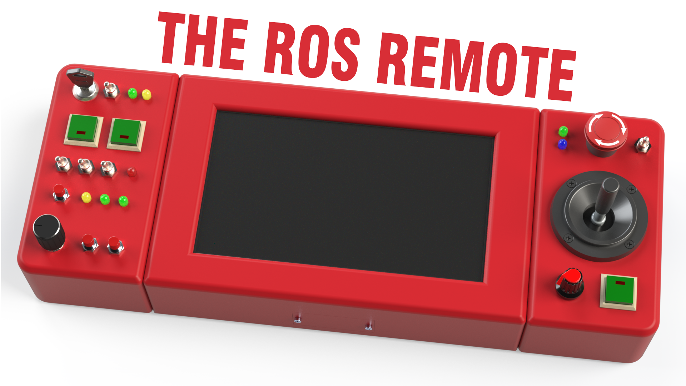

<h1 align="center">The ROS Remote Project</h1>

	 
	 
	  
	
	|
	
	  

----
> [!NOTE]
> This project is under active development.

 

This is a 3D render of the CAD drawings.

 

## Overview
The ROS Remote is a comprehensive remote controller for ROS-based robots. The hardware can, of course, be used with any robot, given that specific software has been prepared for the remote.

 

### Hardware
The remote houses a 7-inch Waveshare touchscreen, a Raspberry Pi 4B 8GB (you can use a 4GB Pi, or a Pi 5 as well, bu I wouldn't recommend anything below the Pi 4), a Raspberry Pi Pico (Pico 1, though a Pico 2 can also be used with some changes to the build configuration of the firmware), and a USB power bank with enough output current capacity to power the Pi and display (3A should be enough. Must be no larger than 62 x 92 x 24mm, please see CAD drawings).

The buttons, switches, and LEDs are all connected to the Raspberry Pi Pico (except for the rotary encoder and three toggle switches on the left side, which are directly connected to the Pi 4's GPIO pins). The Pico exposes two HID device interfaces. One is a generic joystick interface (for buttons, switches, 2-axis joystick, and potentiometer), and the other is a "custom" (vendor-defined HID reports) interface for controlling the LEDs.

 

### Software
The `joy_linux` ROS driver package can be used for publishing data from the joystick interface as a `sensor_msgs/msg/Joy` message to a given topic, and the `joy_teleop` package can be used for robot teleopertation using the `Joy` message. A custom driver package can be found in this repository for interfacing with the LEDs using ROS.

A custom GUI has also been prepared for the screen, which can display a camera feed as well as data from a number of other sensors. This GUI program is designed specifically for use with my [ROS Robot Project](https://github.com/samyarsadat/ROS-Robot), and it is also slightly lacking in terms of performance.

I plan on overhauling this program to improve performance, and make it robot-agnostic. As it stands, any robot which accepts `geometry_msgs/msg/Twist` messages can be teleoperated using the remote with minimal configuration. Additionally, RViz can be used for visualizations, camera feed display, etc. until the remote's own custom GUI program is made robot-agnostic.

You can, of course, write your own programs to change the states of the remote's LEDs, or perform arbitrary actions upon button presses, etc. as they are/can be exposed as standard ROS nodes. The hardware is quite flexible.

 

## File Structure
There are 5 folders in this repository.\
Their names and purposes are as follows:

**.github**\
GitHub issue templates, pull request templates, etc.

**assets**\
Assets used on GitHub (such as images used in this README file).

**cad_files**\
3D CAD design files and 3D printing files.

**electronics**\
Circuit diagrams, and other electrical information.

**source_code**\
Source code for the remote touch UI and Raspberry Pi Pico firmware. 

 

## Contact
You can contact me via e-mail.\
E-mail: samyarsadat@gigawhat.net\

If you think that you have found a bug or issue please report it [here](../../issues).

 

## Contributing
Please take a look at [CONTRIBUTING.md](CONTRIBUTING.md) for contributing.

 

---
Copyright © 2024-2025 Samyar Sadat Akhavi.
